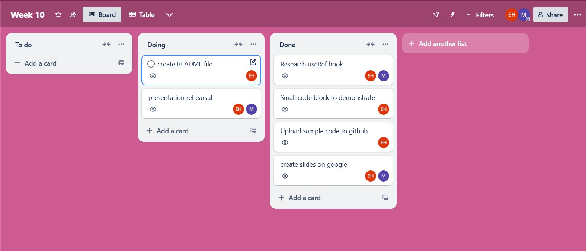

Presentation topic : Hook UseRef()

Team Member : Emine , Mohammed 

Presentation link : [Google Slides Link](https://docs.google.com/presentation/d/1RPFnHaFFnKbD1kFfYEIMGvdEkVpEOhP1Lc3PujorZHQ/edit?usp=sharing) 

- useRef allows you to store and modify values ​​that need to be persisted without triggering rerendering. 
- It’s particularly common to use a ref to manipulate the DOM so we use UseRef to access a specific area in the DOM element.

- Before use UseRef, we need to import it into our React component and  declare a ref.
import { useRef } from 'react';
const Ref = useRef(initialValue);

- useRef() only returns one item. It returns an Object called current.

current: Initially, it’s set to the initialValue you have passed. You can later set it to something else. If you pass the ref object to React as a ref attribute to a JSX node, React will set its current property.
On the next renders, useRef will return the same object.

We reach the reference value with "Ref.current" and we can change this value whenever we want.

What sources did we use?

[React website](https://react.dev/reference/react/useRef)
[w3schools website](https://www.w3schools.com/react/react_useref.asp)
[geeksforgeeks website](https://www.geeksforgeeks.org/react-js-useref-hook/)
Youtube videos for sample code

Project Plan :

We used trello to keep track of our tasks.

